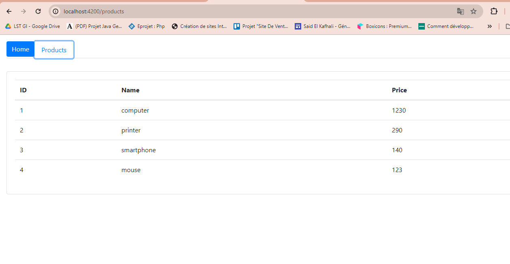
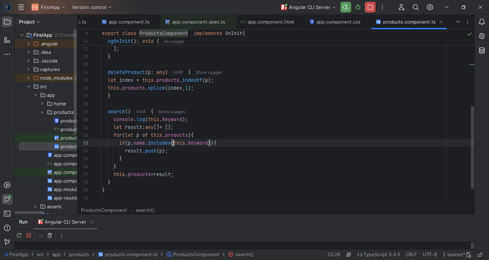
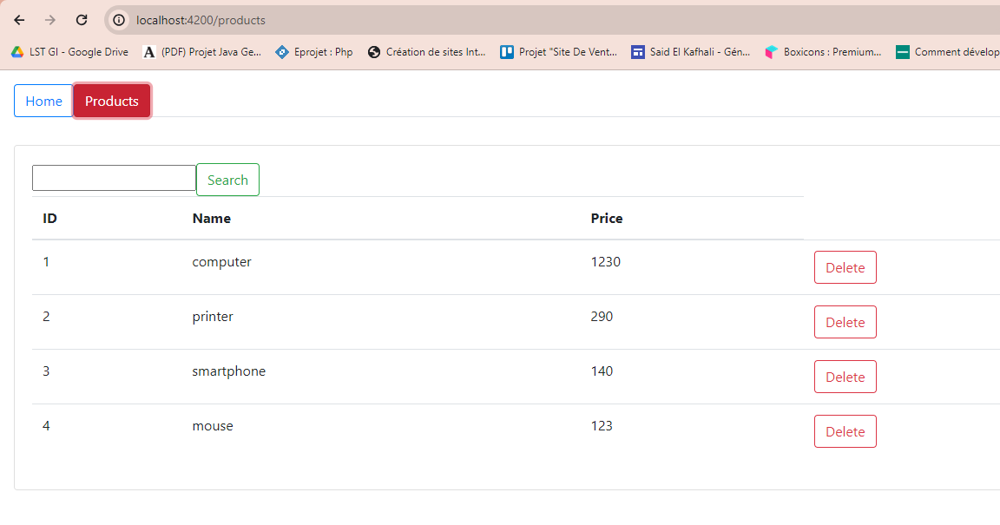

<h1>Coompte Rendu</h1>

<h4>On install bootstrap</h4>

<h4>Pour declarer bootstrap dans "angular.json"</h4>

<h4>pour declarer les composants </h4>

<h4>On utilise le systeme de routage</h4>

<h4>Dans "products.component.ts"</h4>

